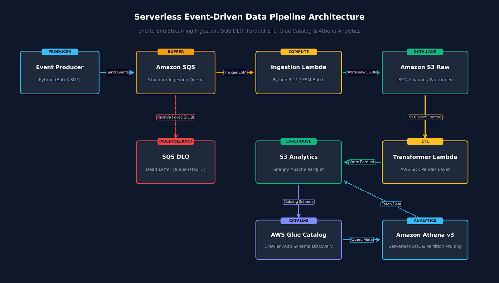
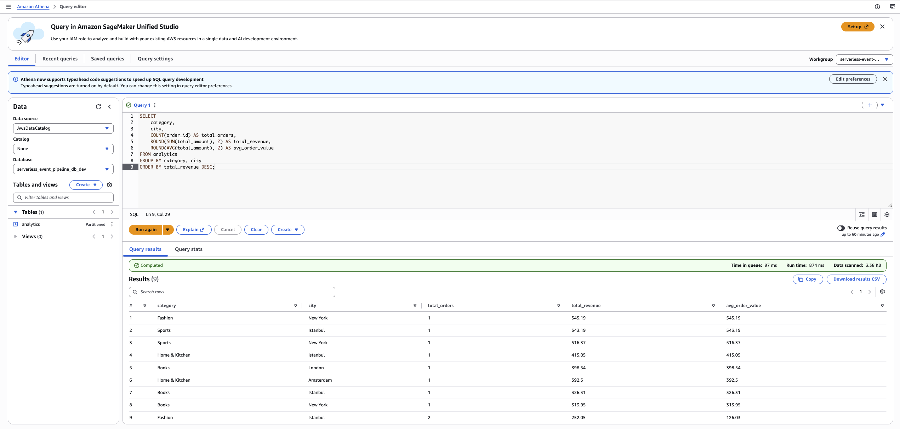
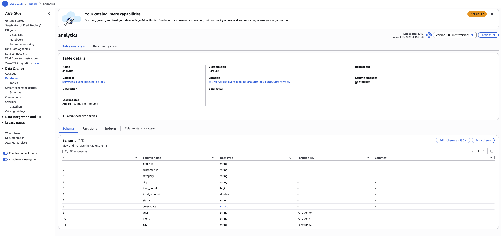
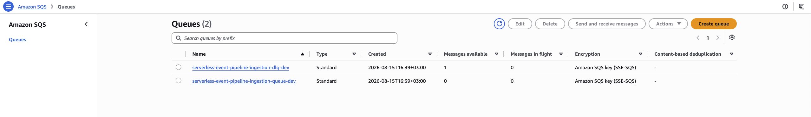

# 🚀 Serverless Event-Driven Data Pipeline & Analytics on AWS

An end-to-end, production-grade serverless data engineering pipeline built on AWS using **Infrastructure as Code (Terraform)**. ⚡

The pipeline ingests streaming order events, buffers them via Amazon SQS with Dead-Letter Queue (DLQ) failover, converts raw JSON payloads into Snappy-compressed Apache Parquet format partitioned by date, catalogs schemas automatically with AWS Glue, and provides serverless analytical querying via Amazon Athena. 📊

---

## 🏗 Architecture Overview



```text
[ Event Producer (Python) ]
           │
           ▼
[ Amazon SQS Queue ] ────────(Redrive Policy)────────► [ SQS Dead-Letter Queue (DLQ) 🚨 ]
           │
           ▼ (Event Source Mapping)
[ AWS Lambda (Ingestion) ⚡ ]
           │
           ▼ (Partitioned Raw JSON)
[ Amazon S3 (Raw Bucket) 🪣 ]
           │
           ▼ (S3 Event Notification: ObjectCreated)
[ AWS Lambda (Transformer / Pandas + PyArrow) 🔄 ]
           │
           ▼ (Snappy Parquet: year/month/day)
[ Amazon S3 (Analytics Bucket) 🪣 ] ────(Lifecycle Transition: 90 Days)────► [ S3 Glacier 🧊 ]
           ▲
           │ (Schema Discovery & Cataloging)
[ AWS Glue Data Catalog & Crawler 🕷️ ]
           ▲
           │ (Interactive SQL Queries)
[ Amazon Athena (Dedicated Workgroup) 🔍 ]
```

---

## 🛠 Tech Stack & AWS Services

* **Infrastructure as Code:** Terraform (Modular architecture: `iam`, `sqs`, `s3`, `lambda`, `analytics`)
* **Messaging & Buffering:** Amazon SQS, SQS Dead-Letter Queue (DLQ)
* **Compute & Processing:** AWS Lambda (Python 3.11, AWS SDK for pandas Layer)
* **Storage & Lakehouse:** Amazon S3 (Raw & Analytics Buckets, SSE-S3 Encryption, Lifecycle Transitions)
* **Data Catalog & Discovery:** AWS Glue Data Catalog, AWS Glue Crawler
* **Query & Analytics Engine:** Amazon Athena (Athena Engine v3, Partition Pruning)
* **Monitoring & Security:** AWS IAM Least-Privilege Roles, Amazon CloudWatch Logs

---

## 🌟 Key Features & Architectural Decisions

1. **⚡ Decoupled & Resilient Ingestion:** SQS acts as a buffer between event producers and compute, preventing downstream Lambda throttling during traffic spikes.
2. **🛡️ Fault-Tolerance & DLQ:** Corrupted or unparseable payloads exhaust retries without blocking the pipeline and land in a dedicated DLQ for post-mortem analysis.
3. **💰 Storage & Query Cost Optimization:** 
   * Row-based JSON events are converted to columnar **Apache Parquet with Snappy compression**.
   * Date partitioning (`year=YYYY/month=MM/day=DD`) enables Athena **Partition Pruning**, minimizing data scanned per query.
4. **🧊 Automated Data Lifecycle:** Analytics bucket lifecycle rules automatically transition 90-day-old datasets to Amazon S3 Glacier to optimize long-term storage costs.
5. **🌐 Zero-Server Maintenance:** Fully serverless architecture scaling automatically from zero to high throughput.

---

## 📂 Project Structure

```text
serverless-event-pipeline/
├── docs/
│   └── images/                     # Architecture & verification screenshots
├── scripts/
│   └── send_events.py              # Synthetic streaming event generator
├── src/
│   ├── ingestion/
│   │   └── handler.py              # SQS consumer -> S3 Raw writer
│   └── transformer/
│       └── handler.py              # S3 Raw -> Parquet converter & partitioner
├── terraform/
│   ├── main.tf                     # Root Terraform orchestration
│   ├── variables.tf                # Global input variables
│   ├── outputs.tf                  # Infrastructure outputs
│   └── modules/
│       ├── iam/                    # Least-privilege IAM roles & policies
│       ├── sqs/                    # SQS primary queue & DLQ
│       ├── s3/                     # Raw & Analytics S3 buckets + lifecycle rules
│       ├── lambda/                 # Lambda compute functions & layers
│       └── analytics/              # Glue Catalog, Crawler & Athena Workgroup
├── requirements.txt                # Project dependencies
└── README.md
```

---

## ⚙️ Deployment & Verification

### 1. 🏗 Provision Infrastructure
```bash
cd terraform
terraform init
terraform apply -auto-approve
cd ..
```

### 2. 📡 Stream Test Events
Generate synthetic e-commerce order events:
```bash
python scripts/send_events.py
```

### 3. 🕷️ Run Glue Crawler & Update Partitions
```bash
aws glue start-crawler --name serverless-event-pipeline-crawler-dev --region eu-central-1
```

### 4. 🔍 Query Data in Amazon Athena
Run analytical SQL queries directly on top of the S3 Analytics lake:
```sql
SELECT 
    category,
    city,
    COUNT(order_id) AS total_orders,
    ROUND(SUM(total_amount), 2) AS total_revenue,
    ROUND(AVG(total_amount), 2) AS avg_order_value
FROM serverless_event_pipeline_db_dev.analytics
GROUP BY category, city
ORDER BY total_revenue DESC;
```

---

## 📸 Verification & Results

### 1. 🔍 Interactive Analytical Queries in Athena
Sub-second query latencies on compressed Parquet with minimal data scanned (~3.38 KB):



### 2. 🕷️ Automated Schema Discovery & Partitioning in Glue
Glue Crawler automatically extracted struct metadata and date partition keys (`year`, `month`, `day`):



### 3. 🚨 Fault-Tolerance & Dead-Letter Queue (DLQ)
Corrupted payloads isolated into the DLQ without blocking valid ingestion workers:



---

## 🧹 Teardown

Destroy all provisioned AWS resources to prevent any costs:
```bash
cd terraform
terraform destroy -auto-approve
```

---

## 📄 License

This project is licensed under the MIT License - see the [LICENSE](LICENSE) file for details.